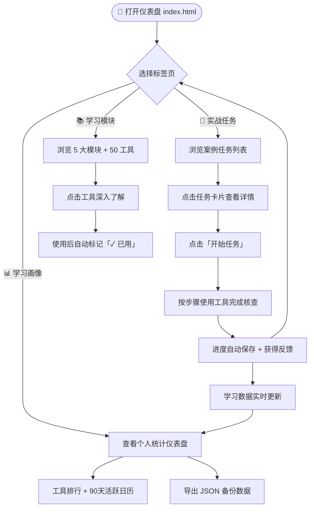

# 🎓 新闻素养学习中枢

> **P00 Dashboard** — 5 大模块 · 50 个工具 · 案例驱动的实战训练  
> 完全本地运行 · 隐私安全 · 适合新手与进阶学习者

一个**无需注册、无需联网（离线可用）**的新闻素养实战学习仪表盘。所有数据仅存储在你的浏览器本地，安全、私密、随时可导出备份。

---

## 🌟 为什么选择它？

- **实战导向**：不是枯燥理论，而是通过真实新闻案例任务链，串联多个工具完成一次完整核查流程
- **系统学习**：5 大核心模块，覆盖 50 个实用新闻素养工具
- **智能反馈**：自动记录学习进度、工具使用频率、学习时长，生成专属「学习画像」
- **数据自主权**：一键导出 JSON 备份、导入恢复、清除重置，数据永远属于你
- **现代化体验**：响应式设计、深浅色主题自动跟随系统、PWA 支持（可安装到桌面/手机主屏幕）

**适合人群**：新闻传播专业学生、媒体素养教育者、事实核查爱好者、任何想提升信息辨别能力的人。

---

## 🚀 快速开始（新手 3 分钟上手）

### 方法一：最简单 —— 直接双击打开（推荐新手）

1. 点击仓库页面右上角绿色 **Code** 按钮 → **Download ZIP**
2. 解压下载的 `P00-dashboard-main.zip`
3. 进入解压后的文件夹，双击打开 **`index.html`**
4. 浏览器自动加载，即可开始使用！

> ⚠️ **小贴士**：首次打开可能提示“脚本运行”，请允许。所有功能均在本地运行。

### 方法二：使用本地服务器（推荐，PWA 功能完整）

推荐使用以下任意一种方式启动本地服务器：

**Python（大多数电脑自带）**
```bash
# 进入项目文件夹后执行
python -m http.server 8000
```
然后在浏览器访问：**http://localhost:8000**

**Node.js（推荐）**
```bash
npx serve .
# 或
npx http-server -p 8000
```

**VS Code 用户**
- 安装 **Live Server** 扩展
- 右键 `index.html` → **Open with Live Server**

启动后，你可以：
- 点击浏览器地址栏右侧的 **安装图标**（或菜单 → 安装应用），将仪表盘安装为独立桌面/手机应用
- 断网后依然可以继续使用（离线缓存已生效）

---

## 📖 功能详解

### 🗺️ 新手学习路径（推荐流程）



**建议顺序**：先从「实战任务」开始做 1-2 个案例 → 再去「学习模块」系统复习 → 最后在「学习画像」查看成长轨迹。

---

### 1. 🎯 实战任务（Missions）

这是**核心学习入口**！

- 每个任务都是一个**真实新闻核查案例**，会引导你按顺序使用 4~5 个相关工具
- 难度由浅入深排列
- 点击任务卡片 → 查看详情 → **🚀 开始任务**
- 任务进行中会高亮当前步骤，完成后自动保存进度
- 支持**重置进度**，随时重新开始

**学习建议**：从第一个任务开始，边做边思考为什么这个工具在这个环节有用。

### 2. 📚 学习模块（Modules）

按新闻素养核心能力分类的 **50 个工具** 总览：

- 5 大模块清晰呈现
- 每个工具都有简要说明
- 点击工具名称可直接跳转对应资源或练习
- **✓ 已用** 表示你已通过该工具产生过学习记录
- **↺ 已恢复** 表示该进度来自任务恢复

适合系统性回顾和查漏补缺。

### 3. 📊 学习画像（Stats）

你的专属学习数据看板（**完全本地**）：

- **总事件数**、**已涉及工具**、**完成任务数**、**总停留时长**
- **🏆 工具使用排行**：柱状图展示你最常用的工具（使用 ECharts 渲染）
- **📅 活跃日历**：过去 90 天学习热力图，一眼看出学习习惯
- **数据操作区**：
  - 📤 **导入数据**：从之前导出的 JSON 文件恢复进度
  - 📥 **导出数据**：一键下载完整学习记录（可备份或迁移到其他设备）
  - 🗑️ **清除全部数据**：谨慎操作，会清空所有本地记录

> 💡 **隐私承诺**：所有数据**永不离开你的设备**，没有服务器、没有账号、没有追踪。

---

## 🛠️ 进阶操作

### PWA 安装（推荐）

启动本地服务器后：
1. 在 Chrome/Edge 等现代浏览器中，点击地址栏右侧的 **+ 安装** 图标
2. 或菜单 → **安装 新闻素养学习中枢**
3. 安装后可像原生 App 一样使用，支持离线、独立窗口

### 数据备份与迁移

- 定期点击 **导出数据**，将 JSON 文件保存到云盘或 U 盘
- 在新设备上打开仪表盘后，点击 **导入数据** 即可无缝继续学习

### 主题切换

右上角或页面内有深色模式切换按钮，自动跟随系统设置，也可手动固定偏好。

---

## ❓ 常见问题（FAQ）

**Q: 为什么有些功能需要本地服务器才能用？**  
A: PWA 安装、Service Worker 离线缓存等现代 Web 功能需要 HTTP 协议（`file://` 协议有限制）。新手直接双击打开也能用 90% 功能。

**Q: 数据会丢失吗？**  
A: 浏览器清除缓存或隐私模式下可能丢失。建议定期**导出备份**！

**Q: 可以多人共用一台电脑吗？**  
A: 可以，但数据是按浏览器存储的。不同浏览器/设备数据独立，建议用「导出/导入」迁移。

**Q: 如何贡献新任务或工具？**  
A: 欢迎！详见下方「开发者说明」或联系仓库维护者。

**Q: 为什么界面有英文混杂？**  
A: 核心内容为中文，部分技术实现保留英文标识，属于正常现象。

---

## 👨‍💻 开发者 / 贡献者说明

本项目包含完善的本地回归测试套件，确保数据安全与功能稳定。

### 本地检查命令

```bash
# 仅语法检查
npm run syntax

# 快速静态检查（推荐）
npm run check

# 仅运行浏览器回归测试（需 Playwright）
npm run browser

# 完整回归流程（静态 + 浏览器）
npm run regression
```

详细测试覆盖范围、存储安全模型、UI 语义契约等技术说明，请参考原版 README 的技术章节或 `scripts/` 目录下的检查脚本。

**核心技术栈**：
- 纯静态 HTML + CSS + JavaScript（无框架依赖）
- ECharts（图表）、Leaflet（地图，可选）、A-Frame（3D，可选）
- Service Worker + Manifest（PWA）
- localStorage + 自定义 metrics 收集层

---

## 📄 许可证与致谢

本项目由 **qcma & CSS Lab** 维护，欢迎 Star ⭐ 和提交 PR！

如有任何问题或建议，请在 GitHub Issues 中反馈。

---

**开始你的新闻素养之旅吧！**  
打开仪表盘，挑选第一个任务，开启实战学习 🚀

*最后更新：2026 年*